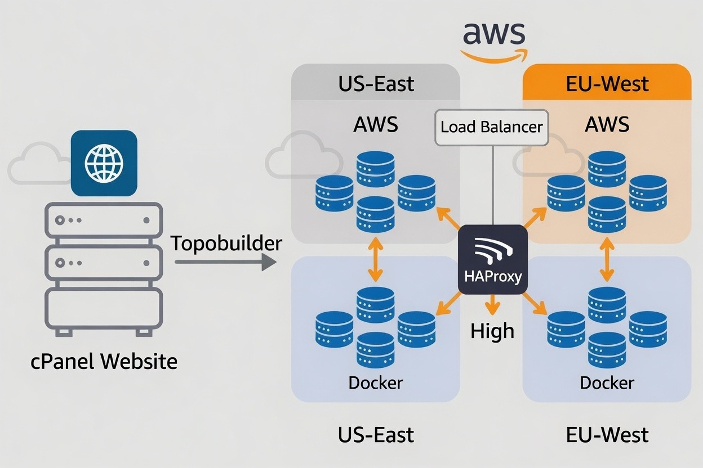

In 2024, I built a piece of software called `topobuilder` in Go. I've referenced it in interviews often enough that it deserves a public page to point at — so here's what it is and how I built it, told through fragments of a closed-source codebase.



**What Is Topobuilder?**

`topobuilder` is a **go binary** that runs off a single **YAML** configuration file that defines an existing PHP website hosted on a cPanel server. The defaults assume that any database connectivity is going to be performed over **RDS** or _another remote connection_. What you're doing is going from a _single region_ into a **multi-region load balanced** containerized application. It takes about 12-36 minutes to deploy a 3-6-9 region cluster with an HAProxy load balancer. 3 regions is 12 minutes; 9 regions defaults to 36 minutes but can also be 12 minutes by adjusting the configuration — though this increases concurrency load and may result in rate limiting from the API utility.

The binary itself is portable — I've run it from DigitalOcean droplets and OVH boxes as easily as from a laptop. What it _provisions_ is AWS. Where `topobuilder` runs and what `topobuilder` builds are two separate questions, and the first one is wide open.

## Go Application Design

What I am going to do is explain this program, how it was built, and give you some insights into Go application design. To begin, we have the `main.go` file that is the primary entry point for the `main()` func.

```go
package main

import (
	"context"
	"flag"
	"fmt"
	"gopkg.in/yaml.v3"
	"log"
	"os"
	"path/filepath"
	"strings"
	"topobuilder/cmd/models"
	"topobuilder/cmd/verbose"
)

const VERSION = "1.0.0"

var (
	runMode     string
	statePath   string
	configFile  string
	showVersion bool
)

func main() {
	flag.BoolVar(&showVersion, "v", false, "show version")
	flag.BoolVar(&showVersion, "version", showVersion, "show version")
	flag.StringVar(&configFile, "config", filepath.Join(".", "cfg.default.yaml"), "Path to cfg.slug-name.yaml")
	flag.StringVar(&verbose.LogDir, "logs", filepath.Join(".", "logs"), "Path to store verbose logs")
	flag.StringVar(&runMode, "mode", ModeDevelopment, "Runtime mode - choices are: "+strings.Join(RunModes(), ", "))
	flag.StringVar(&statePath, "state", "", "Path to state file")
	flag.Parse()

	if showVersion {
		fmt.Println(VERSION)
		os.Exit(0)
	}

	log.Printf("Topobuilder running with: %s %s", runMode, configFile)

	vLogErr := verbose.InitVerboseLogger()
	if vLogErr != nil {
		log.Fatal(vLogErr)
	}

	ctx := context.Background()
	app := models.NewApplication(ctx, runMode, statePath)
	if err := app.LoadConfigs(configFile); err != nil {
		log.Fatal(err)
	}

	app.Run()

	if cleanErr := app.Cleanup(); cleanErr != nil {
		_, _ = fmt.Fprintln(os.Stderr, cleanErr)
		os.Exit(1)
	}

	// exit
	os.Exit(0)
}
```

That's `topobuilder`! 😏🤫 Well, let's actually digest it. Given that I've built [configurable](https://github.com/andreimerlescu/configurable) that became [figtree](https://github.com/andreimerlescu/figtree), why would I use the stdlib `flag` package for `topobuilder`? Because this application doesn't need to dynamically interact with the configuration runtime the way a web server needs to reload its SSL certificates across rotations without forcing the binary to be restarted. In `topobuilder`, we read our configs and then begin processing the application. Right tool, right job.

We'll break each of these down further, but I use the `models` package to return a new `app` that I can use. This is the primary entrypoint for `topobuilder`.

```go
app := models.NewApplication(ctx, runMode, statePath)
```

Once we have an `app`, we need to load the massive YAML config file into the runtime. Instead of getting into _what_ the configurations are for `topobuilder`, I am going to focus on how the `.LoadConfigs(path string)` operates in the `(app *Application)` itself.

```go
if err := app.LoadConfigs(configFile); err != nil {
	log.Fatal(err)
}
```

Once the configurations are loaded, the bulk of the application's processing is actually conducted in this one line:

```go
app.Run()
```

If the `.Run()` has a problem, it'll be captured in the `.Cleanup()` method in the `(app *Application)` definition.

```go
if cleanErr := app.Cleanup(); cleanErr != nil {
	_, _ = fmt.Fprintln(os.Stderr, cleanErr)
	os.Exit(1)
}
```

Now, before we get into the configuration of `topobuilder`, we need to discuss the `verbose` package first.

## The `verbose` package

Extracted into its own package, [verbose](https://github.com/andreimerlescu/verbose) provides a logger capable of scrubbing secrets before they touch STDOUT while preserving the written values to disk in your actual log file.

```bash
go get -u github.com/andreimerlescu/verbose
```

With the **verbose** package, you interact with it using `.AddSecret()`, `.RemoveSecret()`, `.ImportSecrets()`, and `.AddKeyType()` when handling **sensitive data** that you want to _suppress_ from STDOUT, but not from the written log file.

```go
// Existing SHA512 HEX strings + length can be registered below
verbose.ImportSecrets(map[string]int{
    "abc123...sha512hex...": 32,
})

// New header+trailer pattern to filter between values out of logs
verbose.AddKeyType(verbose.KeyType{
    Opening: "BEGIN_MY_SECRET",
    Closing: "END_MY_SECRET",
})

// Add a secret to `verbose` filtering
verbose.AddSecret(verbose.SecretBytes("my-api-token"), "[REDACTED]")

// Remove a secret from `verbose` filtering
verbose.RemoveSecret(verbose.SecretBytes("my-api-token"))

// render a stack trace to return with
verbose.TracefReturn("invalid -name provided: %v", *name)

// bypass sanitization — prints the raw value to the verbose log
verbose.Plain("The raw value is:", *secret)

// this will redact the secret automatically
verbose.Printf("Hello %s, your secret is safe: %s", *name, *secret)
```

With the [verbose](https://github.com/andreimerlescu/verbose) package, you're able to safely register new secrets at runtime and then rely on `verbose.Printf(string, any)` and `verbose.Plain(any)`, plus many other `fmt`-style methods including `verbose.TracefReturn(any)`, `verbose.Sanitize(any)`, and `verbose.Scrub(any)`. Throughout the application, `topobuilder` writes things that could contain secrets to STDOUT, but uses the `verbose` package to ensure that `***` and `[REDACTED]` are what actually appear. This made running a demo in front of stakeholders not a zero-day incident waiting to happen. When I needed the actual values, I could open the text file written to disk and retrieve the raw value that way, or rely on the `verbose.Plain(any)` method.

```go
flag.StringVar(&verbose.LogDir, "logs", filepath.Join(".", "logs"), "Path to store verbose logs")
```

In the `main()` func in the `main.go` file, you can see that we are directly assigning via the `flag.StringVar` method a value directly into the `&verbose.LogDir` string with a default of `./logs` (OS safe). This means that `-logs /var/log/myApp` sets `verbose.LogDir = /var/log/myApp` and it's scoped package-wide regardless of where or what calls `verbose.*`.

## The `models` package

This is where the magic happens and where we'll spend the most time digging in for your learning curiosity.

```go
func (app *Application) LoadConfigs(configFile string) (err error) {
	// validate config file
	if len(configFile) == 0 {
		log.Fatal("invalid -config value provided")
	}
	configFileBytes, readErr := os.ReadFile(configFile)
	if readErr != nil {
		log.Fatal(readErr)
	}
	if err = yaml.Unmarshal(configFileBytes, app.config); err != nil {
		log.Fatal(err)
	}
	verbose.Asis("VERIFYING APPLICATION RUNTIME")
	startedAt := time.Now().Local()

	if err = app.config.Validate(app); err != nil {
		log.Fatal(err)
	}

	verbose.Asf("APPLICATION RUNTIME VERIFIED (took %d seconds)!", int64(time.Since(startedAt).Seconds()))
	return
}
```

This method is small despite doing so much. The `-config` path is read into `topobuilder`, pointing at a **YAML** file containing your runtime configurations. Every failure here is fatal by design — this is the gate, nothing has been provisioned yet, and a half-validated config should never reach `Run()`. Failing loudly at the door is cheaper than failing quietly in region seven.

You'll also see another method from the `verbose` package here — `.Asis(any)` does _as it says_, printing the value _as it is_, meaning no filtering takes place. Static strings like _VERIFYING APPLICATION RUNTIME_ are informational notices that contain _no secrets_ and therefore shouldn't use `verbose.Printf` — otherwise you're spending cycles filtering nothing.

The true magic is happening here:

```go
app.config.Validate(app)
```

In order to understand what this line is doing — and why it can take up to 6 minutes to complete depending on topology size — let's look under the hood. Shall we?

Let's begin with what `Application` is, so we can see what `app.config` is talking about.

```go
type Application struct {
	ctx       context.Context
	mode      ModeType
	config    *Config
	state     *TBState
	stateFile string
	user      *user.User
}
```

We have a `*user.User` stored as `app.user` that can be `nil`, and a `state` + `stateFile` used for a **topobuilder state file**. The `mode` was defined from `main()` above and the `ctx` is passed in from `context.Background()` in `main()` as well.

The `Config` struct is where the rules of engagement live for the **YAML Configuration File** that `topobuilder` accepts as the `-config` value.

```go
type Config struct {

	// Required Properties

	Name            ProjNameKey   `json:"name" yaml:"Name"`
	Slug            ProjSlugKey   `json:"slug" yaml:"Slug"`
	Domain          ProjDomainKey `json:"domain" yaml:"Domain"`
	Mode            ModeType      `json:"mode" yaml:"Mode"`
	Email           string        `json:"email" yaml:"Email"`
	RollbackEnabled bool          `json:"rollback_enabled" yaml:"RollbackEnabled"`

	// Optional Properties

	Firewall     FirewallConfigs     `json:"firewall" yaml:"Firewall"`
	Directories  DirectoriesConfigs  `json:"directories,omitempty" yaml:"Directories,omitempty"`
	OnePassword  OPConfigs           `json:"one_password,omitempty" yaml:"OnePassword,omitempty"`
	AWS          AWSConfigs          `json:"aws,omitempty" yaml:"AWS,omitempty"`
	GitLab       GitLabConfigs       `json:"gitlab,omitempty" yaml:"GitLab,omitempty"`
	EBS          EBSConfigs          `json:"ebs,omitempty" yaml:"EBS,omitempty"`
	Ports        PortsConfigs        `json:"ports,omitempty" yaml:"Ports,omitempty"`
	LoadBalancer LoadBalancerConfigs `json:"load_balancer,omitempty" yaml:"LoadBalancer,omitempty"`
	SSL          SSLConfigs          `json:"ssl,omitempty" yaml:"SSL,omitempty"`
	Docker       DockerConfigs       `json:"docker,omitempty" yaml:"Docker,omitempty"`
	SSHConfigs   SSHConfigs          `json:"ssh,omitempty" yaml:"SSH,omitempty"`
	Wazuh        WazuhConfigs        `json:"wazuh,omitempty" yaml:"Wazuh,omitempty"`
	Secrets      SecretsConfigs      `json:"secrets,omitempty" yaml:"Secrets,omitempty"`
	Times        TimesConfig         `json:"times,omitempty" yaml:"Times,omitempty"`
	ShellKeys    ShellKeys
}
```

The `Config` struct is split into two groups of properties, arbitrarily separated by a comment only, for required and optional. The required properties are flattened types. The optional properties are additional `struct {}` definitions with their own rules. Ultimately, what this flattened `Config struct {}` offers is a **YAML Configuration** that natively looks something like this:

```yaml
---
Name: My Landing Site
Slug: landing-1
Domain: mylandingsite.com
Mode: Development
Email: info@mylandingsite.com
RollbackEnabled: true

Firewall: # properties defined in the FirewallConfigs struct
Directories: # properties defined in the DirectoriesConfigs struct
OnePassword: # properties defined in the OPConfigs struct
AWS: # properties defined in the AWSConfigs struct
GitLab: # properties defined in the GitLabConfigs struct
EBS: # properties defined in the EBSConfigs struct
Ports: # properties defined in the PortsConfigs struct
LoadBalancer: # properties defined in the LoadBalancerConfigs struct
SSL: # properties defined in the SSLConfigs struct
Docker: # properties defined in the DockerConfigs struct
SSH: # properties defined in the SSHConfigs struct
Wazuh: # properties defined in the WazuhConfigs struct
Secrets: # properties defined in the SecretsConfigs struct
Times: # properties defined in the TimesConfigs struct
```

The pattern is that a `<Property>:` at the _root level_ of the **YAML Configuration File** is defined as `type <Property>Configs struct {}` in the Go program — as you see above. So when adding `Something:` it would have a `type SomethingConfigs struct {}` attached to it, defined as YAML using camel-case and JSON using underline_connected_words.

Lines 48-219 of the `config.go` file are dedicated just to the implementation of `app.config.Validate(app)`, expecting back an `error` or `nil`.

First the function handles — without revealing the whole thing — the required properties in series.

```go
errs = data.AppendError(errs, cfg.Name.Validate(app))
```

`data.AppendError` is a helper from the `data` package (similar in spirit to `verbose`) that performs data manipulation tasks like appending an error type, unlike the bare `append(slice, value)` pattern.

`cfg.Name` points to the `Name` property in the `Config` struct. That is a type `ProjNameKey` which has defined:

```go
func (n ProjNameKey) Validate(app *Application) error {}
```

In fact — this pattern is used on every property defined in the `Config` struct, both _optional_ and _required_. What `Validate(*Application)` is doing behind the scenes is calling `.Validate(*Application)` on each element in the `Config{}` itself. That means `WazuhConfigs.Validate(*Application)` is defined and returns an error type, and so does everything else in there.

The next part of the configuration loading is done in a concurrent-where-possible manner that assumes and understands that some tasks take longer than others. This is why I use conditional mutexes as coordinators:

```go
awsCoordinator := sync.NewCond(&sync.Mutex{})
dockerCoordinator := sync.NewCond(&sync.Mutex{})
deploymentCoordinator := sync.NewCond(&sync.Mutex{})
```

Lines 144-159 show us:

```go
// Validate AWS Configs
// awsCoordinator issues Wait signal (blocks this goroutine)
// dockerCoordinator issues Broadcast signal
go func(wg *sync.WaitGroup, errCh chan<- error) {
	defer func() {
		dockerCoordinator.L.Lock()
		dockerCoordinator.Broadcast() // notify all waiting
		dockerCoordinator.L.Unlock()
		wg.Done()
	}()
	awsCoordinator.L.Lock()
	awsCoordinator.Wait()
	awsCoordinator.L.Unlock()
	errCh <- cfg.AWS.Validate(app)
}(&wg, errCh)
```

What these coordinators encode is a **dependency graph**, not just raw parallelism. Each validation goroutine waits on the coordinator that gates it, does its work, and broadcasts the next coordinator on the way out via `defer`. An earlier goroutine broadcasts `awsCoordinator` when its own prerequisites are satisfied, which releases this one; when AWS validation finishes, its `defer` broadcasts `dockerCoordinator`, releasing Docker validation, which eventually chains into `deploymentCoordinator`. The graph is what makes the ordering real — you can't validate a Docker registry against credentials you haven't resolved yet, and you can't resolve those credentials before 1Password has been reached.

Notice that I am passing a pointer to `*Application` into the `Validate(*Application)` method attached to the `AWSConfigs` struct. Also notice how I'm passing the response from that validation directly into `errCh`, which is a buffered channel of errors. Everything that _can_ run wide runs wide; everything with a real prerequisite waits its turn.

For each of the optional configurations, the coordinators balance the order of validation operations needed to properly validate the runtime of `topobuilder` before it deploys anything into the wild.

The `AWSConfigs` struct looks like:

```go
type AWSConfigs struct {
	AccessKey       string     `json:"access_key,omitempty" yaml:"ACCESS_KEY,omitempty"`
	AccessSecretKey string     `json:"access_secret_key,omitempty" yaml:"ACCESS_SECRET_KEY,omitempty"`
	Zones           []*AWSZone `json:"zones,omitempty" yaml:"Zones,omitempty"`
}
```

Your **YAML Configuration** will look like:

```yaml
AWS:
   AccessKey: ""
   AccessSecretKey: ""
   Zones: # the AWSZone struct
```

The `Zones` property in the `AWSConfigs` struct also follows the `.Validate(*Application)` pattern in the `AWSZone` struct itself.

Lines 54-63 of the `config_aws.go` file contain:

```go
if strings.HasPrefix(aws.AccessSecretKey, `op://`) {
	op, pErr := NewOPParse(app, app.config.AWS.AccessSecretKey)
	if pErr != nil {
		return pErr
	}
	value, err := op.GetValue()
	if err != nil {
		return err
	}
	app.config.AWS.AccessSecretKey = strings.Clone(value)
}
```

This magical little block allows the **YAML** to reference **1Password** secrets via the `op://<Vault>/<Item>/<Field>` lookup syntax. If you've also defined the `OnePassword:` properties in the config file, you can use `op://` values and `topobuilder` will look them up and automatically register the retrieved secrets with the [verbose](https://github.com/andreimerlescu/verbose) package — meaning a secret becomes redactable the instant it exists in memory, and your config file on disk never held it in the first place. Throughout many parts of the application we pass the `*Application` pointer directly into struct methods, including `NewOPParse`, which returns a 1Password structure with a bunch of methods attached including `.GetValue()`.

Lines 69-93 in the same file look like:

```go
// THE SETUP

errCh := make(chan error, len(aws.Zones))
doneCh := make(chan struct{})
wg := new(sync.WaitGroup)
errs := make([]error, 0)

// ZONES PROCESSED IN GOROUTINE -> EACH ZONE = GOROUTINE

go func() {
	for i, zone := range aws.Zones {
		i := i
		wg.Add(1)
		go func(wg *sync.WaitGroup, errCh chan<- error, zone *AWSZone, i int) {
			defer wg.Done()
			errCh <- zone.Validate(app, i)
		}(wg, errCh, zone, i)
	}
	wg.Wait()
	close(errCh)
}()

// COLLECT ERRORS

go func() {
	for err := range errCh {
		errs = data.AppendError(errs, err)
	}
	doneCh <- struct{}{}
	close(doneCh)
}()

// WAIT FOR EVERYTHING

<-doneCh
```

First we set up the concurrency channels, slices, and wait group; then we proceed to spawning two **goroutines**. The first is for the _zones processing_ and the second is for the _error collecting_. Each zone defined is spawned into its own goroutine.

Without the `<-doneCh` at the end of the block, the zones would never validate. If the configuration calls for three zones, then there will be three spawned goroutines — one for each zone. If a zone yields an error, that value is passed into `errCh` and then picked up by the error collector via `range errCh`.

After each of these extensive checks is performed on each of the components used throughout `topobuilder`, `app.config.Validate(app)` finally completes!

```go
verbose.Asis("SUCCESSFULLY VALIDATED APPLICATION RUNTIME ENVIRONMENT!")
```

That brings us back up to `main()` where we hand off to `app.Run()` next. Lines 131-194 in `application.go`, the `Run()` method is defined as:

```go

// Run iterates over all AWS Zones and deploys the cluster topology to that endpoint
func (app *Application) Run() {
	fmt.Println("Deploying topology...")
	startedAt := time.Now().Local()
	var err error

	// Start a rollback
	rollback := app.NewRollback()

	// create the load balancer
	rollback, err = app.CreateLoadBalancer(rollback)
	if err != nil {
		// TODO #feature-rollback implement rollback here
		log.Fatal(err)
	}

	// build the image
	rollback, err = app.BuildImage(rollback)
	if err != nil {
		log.Fatalf("BuildDockerImage() failed with err: %v", err)
	}

	// create the topology
	var clusters []*Cluster
	rollback, clusters, err = app.BuildTopology(rollback)
	if err != nil {
		// TODO #feature-rollback implement rollback here
		log.Fatal(err)
	}

	// configure the network
	rollback, err = app.ConfigureNetwork(rollback, clusters)
	if err != nil {
		_, _ = fmt.Fprintf(os.Stderr, "NetworkClusters(app, rollback, clusters[%d]) resulted in networkingErr: %v\n",
			len(clusters), err)
	}
	fmt.Printf("Finished establishing multi-cluster network.")

	// configure HAProxy from the clusters
	rollback, err = app.ConfigureLoadBalancer(rollback, clusters)
	if err != nil {
		log.Fatal(err)
	}

	// update the domain's dns to point to the load balancer
	rollback, err = app.PublishLoadBalancer(rollback)
	if err != nil {
		log.Fatal(err)
	}

	state, stateErr := NewTBState(app, rollback, clusters)
	if stateErr != nil {
		log.Fatal(stateErr)
	}

	saveStateErr := state.SaveTo(app.stateFile)
	if saveStateErr != nil {
		log.Fatal(saveStateErr)
	}

	fmt.Printf("Wrote Topobuilder State to %s\n", app.stateFile)

	app.DeploymentSummary(startedAt, clusters)
}
```

This is where the actual meat and potatoes, so to speak, are contained for the binary. First, I establish a rollback plan. Currently unimplemented, the rollback plan is passed through each of the steps since in the event of a rollback being triggered, that would invoke the block of code in the comment. The scaffolding is threaded everywhere it needs to be — the execution is the next chapter.

When the load balancer is created, a set of `.tf` files are rendered by `topobuilder` in the `DirectoriesConfigs.TerraformDir` property. Then `terraform apply` is executed in that path until the **HAProxy** instance is up and running. `topobuilder` looks at the output of `terraform`, but it requires further capability verification before it continues — Terraform reporting success and the host being ready to do its job are two different claims, and I only trust the second one.

Next we see that `app.BuildImage(rollback)` is called. This connects to **cPanel** and compiles a **Docker Image** based on the PHP website. The `topobuilder` binary uses the `DirectoriesConfigs` struct to define where the `Dockerfile` is going to be written and the path where various `docker` commands will be executed. This method can take a long time depending on the size of the application and network conditions. The file produced is a `.tar.gz` inside the docker workspace directory. It's the image of the container that is going to be deployed on the various endpoints.

During the deployment of the application, `Provisioner` is a struct used throughout the `BuildTopology(rollback)` function. The pattern was `<Utility>Provisioner` for the interface. If the utility was `DockerImage`, then the provisioner was `DockerImageProvisioner`.

```go
type DockerProvisioner interface {
	Installable
	Pingable
	Runnable
	Recoverable
	Prune() error
	Reset() error
}

type ProvisionerDocker struct {
	provisioner *Provisioner
}

// NewDockerProvisioner attaches DockerProvisioner to Provisioner
func NewDockerProvisioner(p *Provisioner) DockerProvisioner {
	return &ProvisionerDocker{provisioner: p}
}

// Status returns a DockerStatus populated with data
func (docker *ProvisionerDocker) Status() *DockerStatus {}

// Recover will attempt to get the docker process started on the Server
func (docker *ProvisionerDocker) Recover() error {}

// Start initiates the docker process on the Server
func (docker *ProvisionerDocker) Start() error {}

// Stop will terminate the docker process
func (docker *ProvisionerDocker) Stop() error {}

// Online checks ps aux for docker on each Instances' Server
func (docker *ProvisionerDocker) Online() bool {}

func (docker *ProvisionerDocker) Reset() error {}

// Uninstall removes docker from the Server
func (docker *ProvisionerDocker) Uninstall() error {}

// Installed checks ps aux for docker on each Instances' Server
func (docker *ProvisionerDocker) Installed() bool {}

// Install puts the docker engine on the Instances Server
func (docker *ProvisionerDocker) Install() error {}

// Prune runs docker prune on each Instances Server
func (docker *ProvisionerDocker) Prune() error {}
```

I define provisioner capabilities using the interfaces as:

```go
type Installable interface {
	Install() error
	Uninstall() error
	Installed() bool
}

type Populatable interface {
	Populatable() PopulatableData
}

type Pingable interface {
	Online() bool
}

type Recoverable interface {
	Runnable
	Pingable
}

type Runnable interface {
	Start() error
	Stop() error
}

type Stateful interface {
	SetState(enabled bool) error
}
```

This means that I can have n-Provisioners with capabilities like being `Stateful`, `Runnable`, `Recoverable`, `Pingable`, `Populatable`, `Installable` — and have predictable behavior across packages like [igo](https://github.com/andreimerlescu/igo) and [counter](https://github.com/andreimerlescu/counter), including `docker` and the **Wazuh Agent**, a DevSecOps monitoring capability supported by `topobuilder`. As each of these provisioners is consumed and used, the output is written via the [verbose](https://github.com/andreimerlescu/verbose) package where the raw values are written to the log file itself. This provides the operator access to see what each instance is doing as it's happening.

The `<Utility>Provisioner` interface is defined to consume the capabilities above like:

```go
type DockerContainerProvisioner interface {
	Recoverable
	Installable
	Runnable
	Pingable
}
```

So you can see that the `<Utility>Provisioner` interfaces contain contracts for various capabilities like being `Recoverable`, `Installable`, `Runnable` and/or `Pingable`.

Then the various Provisioner implementation methods are defined against the following struct:

```go
type ProvisionerDockerContainer struct {
	provisioner *Provisioner
}
```

This pattern is similar — it's `Provisioner<Utility>` in the struct name, and it has its own methods as the `<Utility>Provisioner` interface requires. Read one of these and you can predict all of them, which is the whole point of building it this way.

Next, we see `app.BuildTopology(rollback)` — which executes many of the AWS commands needed to create an EC2 instance and consumes the `EBSConfigs` struct out of the main config. The disk options on the cluster are cluster-wide and defined in one location.

As the topology is created, each zone runs concurrently (though 3 at a time is a configurable limit) as it creates the EC2 instances, uploads the `.tar.gz` image file, and installs the necessary provisioned software for the hosts. Once the load balancer can listen on the configured `Ports:` settings, the AWS networking is secured.

Then we see `app.ConfigureNetwork(rollback, clusters)`. This is where the security groups are configured, the firewalld process, and the connectivity checks take place. This configures port access to and from the instance and the load balancer. This stage ultimately secures the network. A properly configured VPC is required before `topobuilder` can run.

Then, depending on whether **Cloudflare** is being used or if **HAProxy** is being used as the load balancer of choice, the `app.ConfigureLoadBalancer(rollback, clusters)` block is responsible for either running the necessary Cloudflare API calls, or compiling an `haproxy.cfg` file that gets loaded into a new EC2 instance created and designated as the load balancer entrypoint. `topobuilder` establishes secure connectivity between each endpoint and uses encrypted traffic for all data transmissions.

Once the **HAProxy** load balancer is **healthy**, then we can run `app.PublishLoadBalancer(rollback)`, which issues a DNS record update to the **Cloudflare API** to set the `Domain: <string>` value from the **YAML Configuration** file defining the website you're deploying the cluster out to. This A record gets updated to the **HAProxy** instance.

Once the cluster has been created, the docker image deployed and launched, running and healthy, and the load balancer up and serving traffic on all endpoints in a health-check-verified manner, `NewTBState(app, rollback, clusters)` is invoked next. This writes a new `.tbstate` JSON structured text file that records the state of the output of the entire deployment step by step, including timestamps of when things were executed. This _log of record_ is maintained during the runtime of `topobuilder` and is part of the `rollback` functionality. Once the state of the cluster is compiled, it's saved via `state.SaveTo(app.stateFile)` before `app.DeploymentSummary(startedAt, clusters)` is called to render a summary of the deployment to STDOUT.

## Why I Built This

Front end landing pages like a basic PHP website that uses an **RDS** connected database are the perfect contender for `topobuilder`. It allows for **spot instances** to be selected in the configuration, and a campaign to be executed for a FRACTION OF THE COST. Ultimately — if you have a large cluster of instances serving thousands of clients, you can do it in the first class cabin for a premium. You might call that Kubernetes or Elastic Container Service (ECS). I built the budget Spirit Airlines alternative. Yes, `topobuilder` truly is like _Spirit Airlines_ 🤫 — no seat recline, gets you there, costs a quarter as much.

That's also my honest answer when someone asks _what do you know about Kubernetes_. I know enough to understand the _tax_ associated with its operations, and enough to explain to EVPs and CTOs what each option actually gives them and what it costs. `topobuilder` was built in a single month and delivered for a major launch. OPEX dropped dramatically because of it. When I interview with your company, I am interviewing _you_ just as much as _you are interviewing me_ — it goes both ways — and this is exactly the kind of tradeoff I want to be talking about in that room.

I'm talking about it now because it was super cool to build. The source stays closed — the use case is narrow enough that releasing it wouldn't serve anyone, and it was built two years ago and _has not been updated since_. It hasn't needed updating. ❤️‍🔥 For now 😏🤫. But how I built the configuration and the provisioners themselves are the meat and potatoes I'm offering for your reading time this Wednesday in July.

Alongside that, [The Library](https://dev.to/andreimerlescu/when-ai-creates-a-closed-source-world-2oin) still needs contributions despite being [Locked In With AI](https://dev.to/andreimerlescu/locked-in-with-ai-5g60), and Applicant Tracking Systems continue to do what they've done to the [interviewing market](https://dev.to/andreimerlescu/five-hours-of-interviewing-zero-questions-about-the-job-378k). A single `topobuilder` config file can run a few hundred lines, and its syntax is legible directly from the structs above — which is also why AI-powered documentation systems digest this application so effectively.

## Conclusion

I've been writing software for 17 years, since graduating college as a **Computer Engineer** and running the IEEE Student Branch I joined as a widdle freshman. At Cisco and Oracle, much of my career was closed source and off limits. After the pandemic, I wanted to give selflessly without expecting anything in return. That's why I wrote [Project Apario](https://github.com/ProjectApario) into a three binary trinity called [reader](https://github.com/ProjectApario/reader), [writer](https://github.com/ProjectApario/writer) and [search](https://github.com/ProjectApario/search).

When the problem statement was made by the client that requested `topobuilder`, I assured them that **I have built complex software in Go from start to finish that is stable and shipped into production for months with minimal updates needed for maintenance** — and then, with their _trust_, I built `topobuilder` over a single month. It combined many years of experience deploying multi-region architectures and all the manual work involved in getting any of those automated systems to actually work. I wanted to build something that could go from start to finish in a way I understood top to bottom. `topobuilder` was the result.

One number surprised me. When I ran text analysis against the repository, out of roughly 72,000 words of source there were only about 4,800 unique ones — an average of 15 repetitions each. That's not mystery, it's what a small pattern language looks like from the outside: `Validate(*Application)` on every config type, `<Utility>Provisioner` for every contract, `Provisioner<Utility>` for every implementation, the same capability verbs on every host. Once you've seen the pattern three times, you've seen all fifteen instances of it. 🤣

There's plenty I've left out here — how `BuildImage` turns a live cPanel site into a reproducible image, where the rollback design is headed, how nine regions collapse from 36 minutes to 12. Those are better conversations than paragraphs, and I'm always glad to have them.

The source stays closed. The ideas don't have to be — the config validation pattern and the provisioner capability interfaces are above in full, and they're yours to take. Twelve minutes, one YAML file, three regions, one binary I understand top to bottom.
